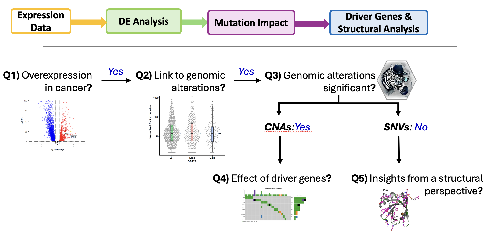

# OBP-cancer

A computational and molecular analysis of OBP2A and OBP2B gene and protein expression in cancer, integrating TCGA datasets, mutation profiles, differential gene expression analysis (DGE), and Computational Identification of Biologically Relevant Alterations (CIBRA). This project investigates the functional relevance of odorant-binding proteins in oncology.

[](LICENSE)
[](https://www.cancer.gov/tcga)
[](https://cran.r-project.org/)

---

## 🔬 Overview

This repository includes code and data for:
- Expression analysis of OBP2A and OBP2B genes across cancer types (ovarian, breast, uterine, prostate, melanoma, lung, and colorectal cancers).
- Integration of SNV, CNA, and RNA-seq profiles.
- Visualization using `ggplot2`, `maftools`, `EnhancedVolcano`, `ComplexHeatmap`, and more.
- Outputs of oncoplots, boxplots, DGE and CIBRA analysis results.

Key words: 
OBP2A, OBP2B, Lipocalin superfamily, Olfactory sense, Hydrophobic ligand transport, Protein function and classification, Differential gene expression


---

## 📁 Repository Structure

```
OBP-cancer/
├── data/                 # Processed input data from TCGA (SNV, CNA, RNA)
├── scripts/              # Analysis scripts in R
│   ├── visualization/
│   ├── meta-analysis/
├── results/              # Output plots, tables, and figures
├── notebooks/            # Rmarkdown exploratory analysis
├── docs/                 # Documentation (setup, methods)
├── .github/              # GitHub-specific templates
│   └── ISSUE_TEMPLATE.md
├── LICENSE
├── README.md
└── CITATION.cff
```

---

## 🧰 Requirements

- R ≥ 4.3.1
- R packages: `CIBRA`, `DESeq2`, `ggprism`, `maftools`
- `Python ≥ 3.10` for cross-platform processing or plotting

### 1️⃣ To install R packages:

```r
install.packages(c("data.table", "R.utils", "dplyr", "ggplot2", "gridExtra", "ggprism", "ggbeeswarm", "plyr", "tidyverse", "scales", "gtable", "ggalt", "BiocManager"))
BiocManager::install(c("CIBRA", "BiocParallel", "UCSCXenaTools", "limma", "edgeR", "DESeq2", "maftools", "EnhancedVolcano"))
``` 

### 2️⃣ Clone the repo:
```r
git clone https://github.com/CMFTIME7/OBP-cancer.git
cd OBP-cancer
```


---
## 🧪 Analysis

This section provides an overview of key figures generated with analysis use related data, including CIBRA results, differential gene expression (DGE) analysis, and visual summaries using boxplots and oncoplots.


| 📊 CIBRA                     | 🔬 DGE_analysis                  | 📦 Boxplots                     | 🧬 Oncoplots                    |  
|------------------------------|----------------------------------|---------------------------------|---------------------------------|  
| Overview of genetic alternations and mutational profile using the CIBRA algorithm. | Results of differential gene expression analysis across relevant tissue or cancer datasets. | Visual summaries of expression levels or scores across sample groups. | Mutational landscape highlighting key genes across sample groups. |  
| **Description:** accurate for full overview of alterations that even have low frequency. | **Description:** related conditions compared, notable genes included and visualized using volvano plots. | **Description:** targeted genes and metrics are being compared. | **Description:** compare the normalized expression levels of OBP2A and OBP2B among WT, gain and loss. |


---
## Data 
Data retrived from TCGA can be downloaded from cBioportal: https://www.cbioportal.org/

Databases used: HPA (https://www.proteinatlas.org/),  PaxDB (https://pax-db.org/), GTEx (https://www.gtexportal.org/home/), NCI - PDC (https://proteomic.datacommons.cancer.gov/pdc/), TCGA (https://www.cancer.gov/ccg/research/genome-sequencing/tcga), UCSC Toil Recompute Compendium (https://xenabrowser.net/datapages/), cBioportal (https://www.cbioportal.org/), Uniprot (https://www.uniprot.org/), RCS - PDB (https://www.rcsb.org/)

---
## Workflow 
The schematic overview of the meta-analysis approach using research questions from the structured literature overview


---
## Outlook

Consider future perspectives onto pathway analysis use `clusterProfiler::GSEA()` and binding assays in molecular dyncamics simulations and experimental validations.

---
## Contact

For questions, suggestions, or collaboration:

📧 Email: [c.chenmifen@vu.nl](mailto:your.email@example.com)  
